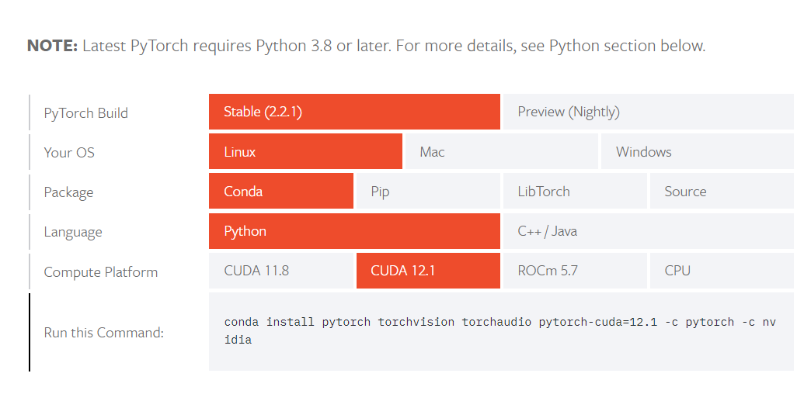

## Miniconda Installation

https://docs.anaconda.com/free/miniconda/#quick-command-line-install

```bash
# Install Miniconda
mkdir -p ~/miniconda3
wget https://repo.anaconda.com/miniconda/Miniconda3-latest-Linux-x86_64.sh -O ~/miniconda3/miniconda.sh
bash ~/miniconda3/miniconda.sh -b -u -p ~/miniconda3
rm -rf ~/miniconda3/miniconda.sh

# Initialize conda
~/miniconda3/bin/conda init bash
```
## Environment Setup

https://pytorch.org/get-started/locally/

Customize the pytorch installation based on your system and requirements. choose os, version, GPU/CPU, and package manager.



```bash
# Create conda environment and activate it 
conda create -n pytorch-env python=3.10
conda activate pytorch-env

# install pytorch and torchvision   
pip3 install torch torchvision torchaudio

# install requirements
pip install -r ./requirements.txt
```

## Verification:
```bash
# start jupyter notebook
# in the terminal
jupyter notebook .
```

Run the following code snippet in a new jupyter notebook cell to verify the installation.
```python
# Verify the installation
# in a new jupyter notebook cell

import torch

# Create a tensor
x = torch.rand(5, 3)
print(x)

# Verify GPU availability
print(torch.cuda.is_available())
```
